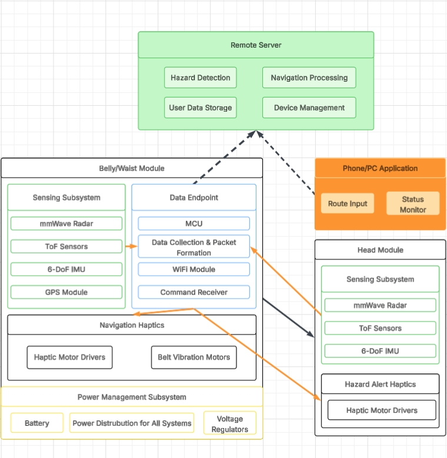

# ECE445 Group10 Lab Notebook

This repository is a digital lab notebook. Entries are kept in `notebook/` as dated Markdown files.

## Structure
- `notebook/` daily logs
- `assets/` images and attachments

## Rules
- Log work with dates
- Commit frequently (no rewriting history)

# Block Diagram

# Three High-Level Requirements
1. Safety Requirement: The system shall detect approaching hazards (bicycles, e-scooters, pedestrians) with ≥90% recall at distances ≥5 meters and provide directionally accurate haptic alerts to the user's head module, ensuring 360° coverage through dual-plane sensing (belly and head modules).    
2. Navigation Requirement: The system shall provide hands-free, non-visual navigation guidance with ≥85% turn accuracy through the belly haptic interface, maintaining heading deviation ≤10° during straight-line navigation, with update latency ≤200ms from position change to haptic feedback.   
3. Channel Separation Requirement: The system shall maintain distinct and unambiguous feedback channels where the head module exclusively provides hazard alerts and the belly module exclusively provides navigation cues, achieving ≥90% user classification accuracy between hazard and navigation signals to prevent confusion during simultaneous alerts.   

# Subsystem Requirements
1. Belly/Waist Module - Sensing Subsystem    
Requirement: Must achieve 360° obstacle detection with ≥90% recall rate for approaching objects (bikes/scooters) at distances ≥5 meters, using integrated mmWave radar (rear/diagonal coverage), ToF sensors (lateral coverage), and front-lower obstacle detection. 
2. Belly/Waist Module - Navigation Haptics Subsystem    
Requirement: Must provide directional navigation cues through belt-mounted vibration motors with ≤200ms update latency and achieve ≥85% turn accuracy when translating bearing differences from IMU heading into tactile feedback patterns. 
3. Head Module - Hazard Alert Haptics Subsystem    
Requirement: Must deliver directional hazard alerts through 8 motors (45° spacing) with ≤250ms latency from detection to vibration, achieving ≥90% directional correctness for alerting users to approaching threats. 
4. Power Management Subsystem    
Requirement: Must provide ≥4 hours of continuous operation for both modules combined (total system mass ≤350g, head module ≤150g) with integrated Li-ion battery, charging circuitry, and voltage regulation for all sensing, compute, and haptic components. 
5. Remote Server Subsystem    
Requirement: Must process hazard detection algorithms, manage navigation routing, store user data, and maintain device connectivity with sufficient computational resources to support real-time multi-sensor fusion and route calculation.

## Plans(Expected)
- 2.20 - Complete components selection
- 2.26 - Complete design, ready for review
- 3.4 - Purchase components
- 3.6 - Complete breadboard
- 3.13 - components test/coding start
- 3.23 - Start building/testing
- 3.30 - Mock test 1 
- 4.7 - Debugging/updating
- 4.14 - Mock test 2
