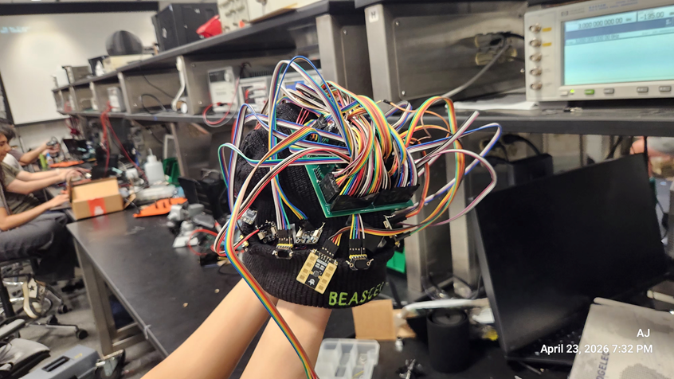
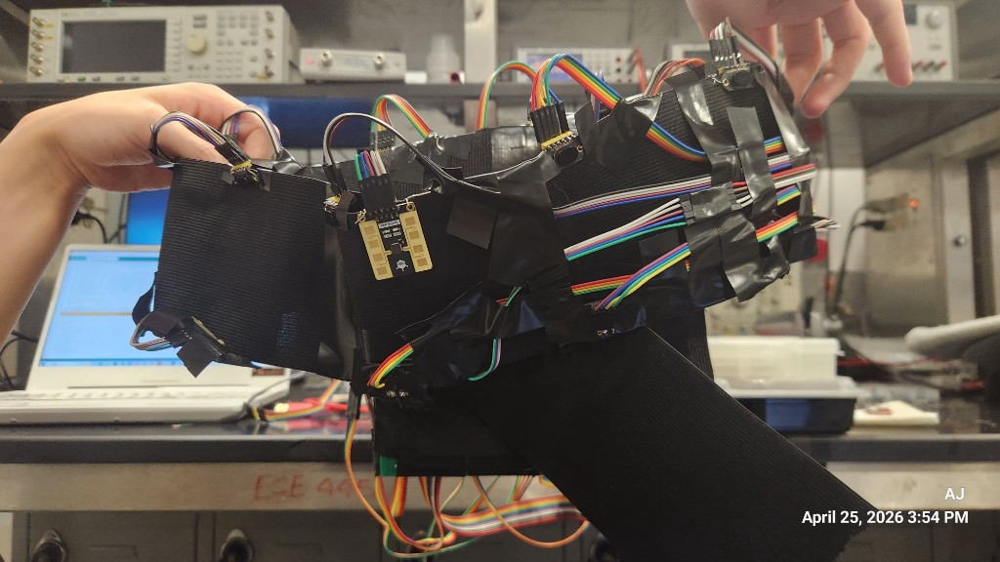
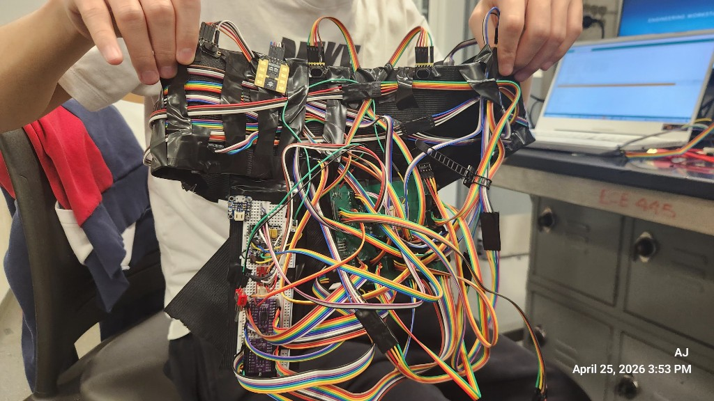

# OmniSense-Dual — ECE 445 Group 10

A wearable obstacle-detection system for visually impaired users, consisting of a **head module** and a **waist module**, each powered by an ESP32-S3. Sensor data is fused on a Flask server and translated into haptic feedback on the head module.

**Team Members:** Alex · Jiateng · Simon

---

## Repository Structure

```
lab-notebook-ece445-group10/
├── notebooks/               # Lab notebooks (ECE 445 requirement)
│   ├── images/              # Shared hardware photos and diagrams
│   ├── alex/
│   │   └── README.md
│   ├── jiateng/
│   │   └── README.md
│   └── simon/
│       └── README.md
├── src/                     # Core source code
│   ├── algorithm.py         # Sensor fusion & haptic mapping algorithm
│   ├── server.py            # Flask server
│   ├── test_server.py       # Server tests
│   └── conftest.py          # Pytest configuration
├── frontend/                # Web dashboard
│   ├── index.html
│   ├── sensor_dashboard.html
│   ├── app.js
│   ├── style.css
│   ├── FRONTEND_CODE.md
│   └── USER_GUIDE.md
├── tests/                   # Hardware & integration tests
│   ├── esp_dev_test.ino
│   ├── real_test.ino
│   ├── test_without_http.ino
│   ├── power_system_test.ino
│   ├── tof_and_power_test.ino
│   ├── minimal_test.ino
│   ├── test_integration.py
│   ├── test_unit.py
│   └── __init__.py
├── sketch_mar9a/            # Arduino sketch (Mar 9 version)
│   └── sketch_mar9a.ino
├── docs/                    # Design documentation
│   ├── ALGORITHM_DESIGN.md
│   └── TESTS_REFERENCE.md
├── ECE445_group10_design (1).pdf
├── head_module_1.png        # Head module assembly photo
├── head_module_2.png
├── waist_module_1.png       # Waist module assembly photo
└── waist_module_2.png
```

## Hardware

| Head Module | Head Module |
|-------------|-------------|
|  |  |

| Waist Module | Waist Module |
|--------------|--------------|
|  |  |

---

## System Overview

| Module | Placement | Purpose |
|--------|-----------|---------|
| **Head** | Head / helmet | Detects head-height hazards (overhangs, signs, doorframes) |
| **Body** | Waist / torso | Detects body-level hazards (furniture, walls, people) |

Each module runs its own ESP32-S3 and sends sensor packets to the Flask server over Wi-Fi. The server fuses both data streams into a single set of 8 haptic motor commands sent back to the head module.

## Quick Start

```bash
# Install dependencies
pip install flask numpy

# Run the server
python src/server.py
```
