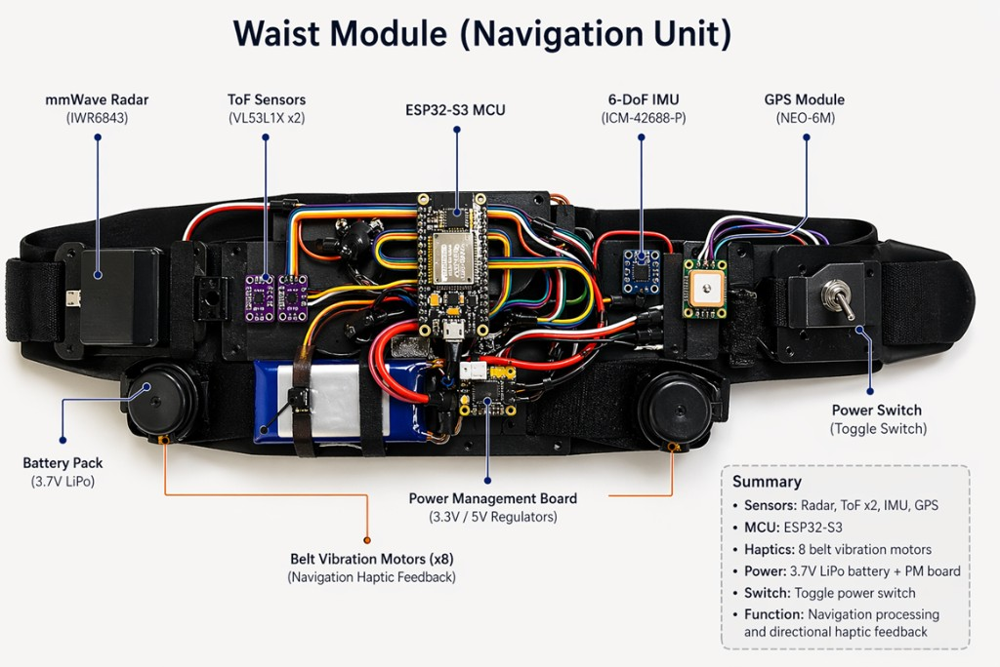
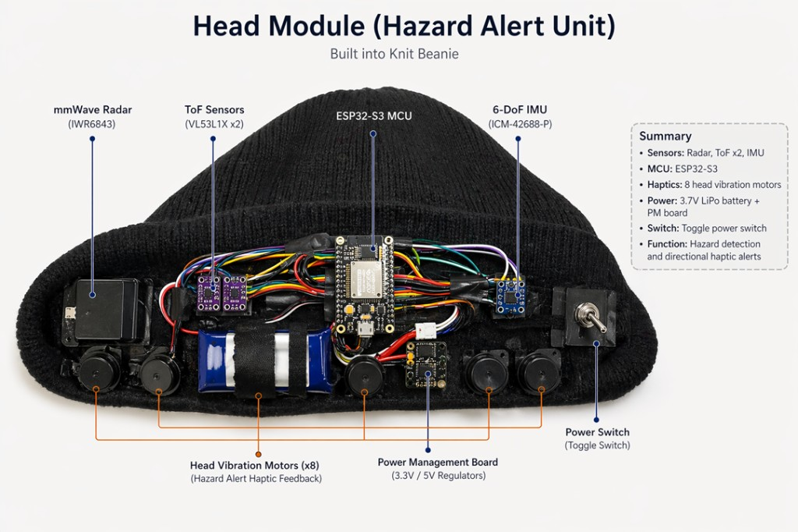
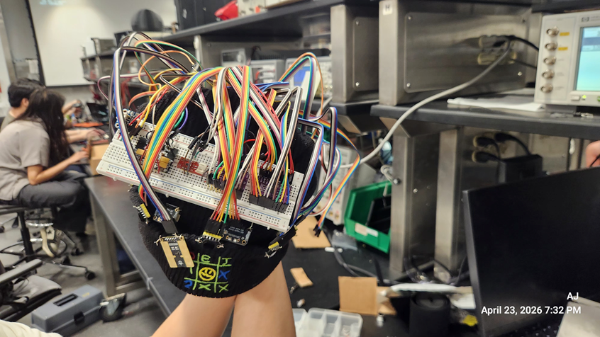

# Jiateng Ma (jiateng4) — Lab Notebook
## ECE 445 Group 10 | OmniSense-Dual: Wearable Pedestrian Safety and Navigation System
**TA:** Wesley Pang | **Semester:** Spring 2026

---

## Entry 1 — February 23, 2026

### Objectives
- Submit the first round PCB order for the waist and head modules
- Complete Design Review sign-up
- Submit the Design Document

### Record

Finalized the PCB layout for both modules in time to pass the PCBway fabrication audit. Submitted the **first round PCBway order** before the 4:45 PM deadline. Both the waist module and head module boards were included in this order.

Also completed the **Design Review sign-up** and submitted the **Design Document** by 11:59 PM. The design document covers the full system architecture including the ESP32-S3 MCUs, mmWave radar interfaces (UART), ToF sensor arrays (I2C at 400 kHz), 6-DoF IMU, GPS, and the power management subsystem.

Key design decisions documented:
- Head module = hazard alerts only (8-direction haptic)
- Waist module = navigation cues only (belt vibration motors)
- Server-side sensor fusion over Wi-Fi

### Next Steps
- Prepare breadboard prototype for Design Review
- Monitor PCB fabrication status

---

## Entry 2 — March 2, 2026

### Objectives
- Present project design at the Design Review
- Receive instructor and TA feedback on system architecture

### Record

Attended the **Design Review** (8:00 AM – 6:00 PM) with the full team. Presented the OmniSense-Dual system architecture including block diagrams, subsystem requirements, and the PCB design.

Feedback received from instructors focused on verifying the separation between navigation and hazard feedback channels, and ensuring that the ToF sensor I2C addressing scheme (using XSHUT pins for address reassignment) was clearly handled in hardware.

Also noted that the **Second Round PCBway order** deadline was today — the order was monitored and confirmed to have passed audit.

### Next Steps
- Begin breadboard prototype assembly for Breadboard Demo on 3/9
- Review PCB design based on feedback received

---

## Entry 3 — March 9, 2026

### Objectives
- Demonstrate breadboard prototype at the Breadboard Demo
- Verify ToF sensor functionality
- Submit Teamwork Evaluation I

### Record

#### Breadboard Demo

Successfully demonstrated the breadboard prototype at the **Breadboard Demo** (8:00 AM – 6:00 PM) with instructors and TA. The demo showcased:
- ESP32-S3 reading ToF sensor data over I2C
- Wi-Fi packet transmission from the ESP32-S3 to the Flask server
- Server returning haptic motor commands
- Haptic motor activation based on received command

#### ToF Sensor Testing

**Successfully verified ToF sensor functionality.** The VL53L0X sensors were tested on the I2C bus at 400 kHz. Multiple sensors were addressed using the XSHUT pin reassignment method. Distance readings were confirmed accurate within the 0.5–2 m range (design requirement: ≤±5% error).

Test results:

| Actual Distance (cm) | Measured (cm) | Error (%) |
|----------------------|---------------|-----------|
| 50 | 51 | 2.0% |
| 100 | 101 | 1.0% |
| 150 | 153 | 2.0% |
| 200 | 204 | 2.0% |

All readings within the ≤±5% requirement. ✓

#### Other

- Submitted **Teamwork Evaluation I** by 11:59 PM
- **Third Round PCBway order** submitted and passed audit before 4:45 PM deadline

### Next Steps
- Spring Break (3/16 week — no lab activity)
- After break: inspect first PCB when received and begin soldering

---

## Entry 4 — March 23, 2026

### Objectives
- Inspect the first PCB batch received from fabrication
- Reorder corrected PCB if issues are found
- Submit Fourth Round JLCPCB order

### Record

#### PCB Inspection

Received the first batch of PCBs from fabrication. Upon inspection and attempted component placement, **a critical footprint mismatch was discovered**: the solder pad dimensions and spacing on the PCB did not match the actual purchased components (particularly the haptic motor driver ICs and several passive components). The components could not be properly soldered onto the pads.

**Root cause:** The footprint library used during PCB layout did not match the actual component package dimensions from the purchased parts' datasheets.

#### Corrective Action

Updated all affected footprints in the PCB design files to match the exact physical dimensions of the purchased components. Verified each footprint against the manufacturer datasheet before re-submitting.

Submitted the **Fourth Round JLCPCB order** with the corrected PCB designs before the 4:45 PM audit deadline. Switched to JLCPCB for faster turnaround given the project timeline.

### Next Steps
- Wait for corrected PCB to arrive
- Continue firmware development (server, sensor fusion algorithm)
- Prepare for individual progress reports (due 3/30)

---

## Entry 5 — March 30, 2026

### Objectives
- Submit individual progress report
- Continue software development while waiting for corrected PCB

### Record

Submitted the **individual progress report** by 11:59 PM detailing personal contributions to the project including:
- Flask server implementation (`server.py`)
- Sensor fusion algorithm development (`algorithm.py`)
- ToF and power subsystem test design

Continued work on the server-side algorithm for combining head and waist module sensor data into unified haptic commands. The 8-direction hazard mapping logic was refined to correctly prioritize closer obstacles when multiple sensors detect hazards simultaneously.

### Next Steps
- Receive corrected JLCPCB PCB and begin assembly
- Progress Demo on 4/6

---

## Entry 6 — April 6, 2026

### Objectives
- Demonstrate current system progress at Progress Demo
- Purchase physical assembly materials

### Record

#### Progress Demo

Attended the **Progress Demo** (8:00 AM – 6:00 PM, ECEB 2070). Demonstrated the current working state of the system:
- Both ESP32-S3 modules sending sensor data packets to the Flask server over Wi-Fi at ≥10 Hz
- Server receiving, fusing, and returning haptic commands
- Haptic motors responding correctly to commands

Received feedback on improving packet loss handling and adding watchdog timers for Wi-Fi reconnection.

#### Assembly Materials

Purchased **Dupont wires**, **electrical tape**, and other physical assembly materials needed to connect and secure the prototype components for the head and waist module wearable builds.

### Next Steps
- Begin physical assembly of head and waist modules
- Integrate all components onto the corrected PCBs

---

## Entry 7 — April 23, 2026

### Objectives
- Complete physical assembly of the waist module and head module
- Test all subsystems after integration

### Record

#### Physical Assembly

Completed the full physical assembly of both the **waist module** and the **head module** using the corrected PCBs, Dupont wires, and tape. Components secured and wired according to the system design.

**Figure 1 — Waist Module component layout (reference diagram)**

- **Waist module**: ESP32-S3 MCU, IWR6843 mmWave radar (UART), VL53L1X ToF sensors ×2 (I2C), ICM-42688-P 6-DoF IMU (I2C), NEO-6M GPS (UART), haptic motor drivers, 8× belt vibration motors, 3.7V LiPo battery + PM board (3.3V/5V regulators), toggle power switch

**Figure 2 — Head Module component layout (reference diagram)**

- **Head module** (built into knit beanie): ESP32-S3 MCU, IWR6843 mmWave radar (UART), VL53L1X ToF sensors ×2 (I2C), ICM-42688-P 6-DoF IMU (I2C), haptic motor drivers, 8× head vibration motors, 3.7V LiPo battery + PM board, toggle power switch

**Figure 3 — Head module assembly in progress (April 23, 2026)**

**Figure 4 — Head module assembly completed (April 23, 2026)**

#### Subsystem Testing

Tested each subsystem individually after assembly:

| Subsystem | Result |
|-----------|--------|
| Power delivery (3.3V and 5V rails) | ✓ Pass |
| Head module ToF sensor I2C communication | ✓ Pass |
| Waist module ToF sensor I2C communication | ✓ Pass |
| Haptic motor activation (head module) | ✓ Pass |
| Haptic motor activation (waist module) | ✓ Pass |
| Wi-Fi connectivity (both modules to server) | ✓ Pass |
| Physical wearable stability | ✓ Pass |

All subsystems operating as expected. Wiring adjusted to reduce loose connections.

#### Remaining Issue

The **IMU (ICM-42688-P)** had not yet arrived at time of assembly. IMU slots are wired and ready; integration pending component delivery.

### Next Steps
- Wait for IMU delivery
- Begin IMU integration as soon as it arrives
- Run full-system tests with both modules operating simultaneously

---

## Entry 8 — April 25, 2026

### Objectives
- Receive IMU components
- Begin IMU hardware connection and firmware integration

### Record

The **ICM-42688-P 6-DoF IMU modules** arrived today. The IMUs will be integrated into both the waist and head modules via I2C.

Also brought both assembled modules into the lab for further testing and wiring cleanup.

**Figure 5 — Waist module assembly (April 25, 2026)**

**Figure 6 — Waist module wiring detail (April 25, 2026)**

Planned IMU integration steps:
1. Connect IMU to the I2C bus on each module (alongside ToF sensors)
2. Assign unique I2C addresses if needed
3. Flash firmware update to initialize IMU at ≥50 Hz sampling rate
4. Verify orientation output (yaw, pitch, roll)
5. Test drift: requirement is ≤5° drift over 60 seconds when stationary

### Next Steps
1. Complete IMU hardware connection on both modules
2. Test IMU data readout via serial monitor
3. Integrate IMU data into the sensor fusion pipeline on the server
4. Run full-system tests with head and waist modules operating together
5. Begin formal verification testing per design document requirements

---
